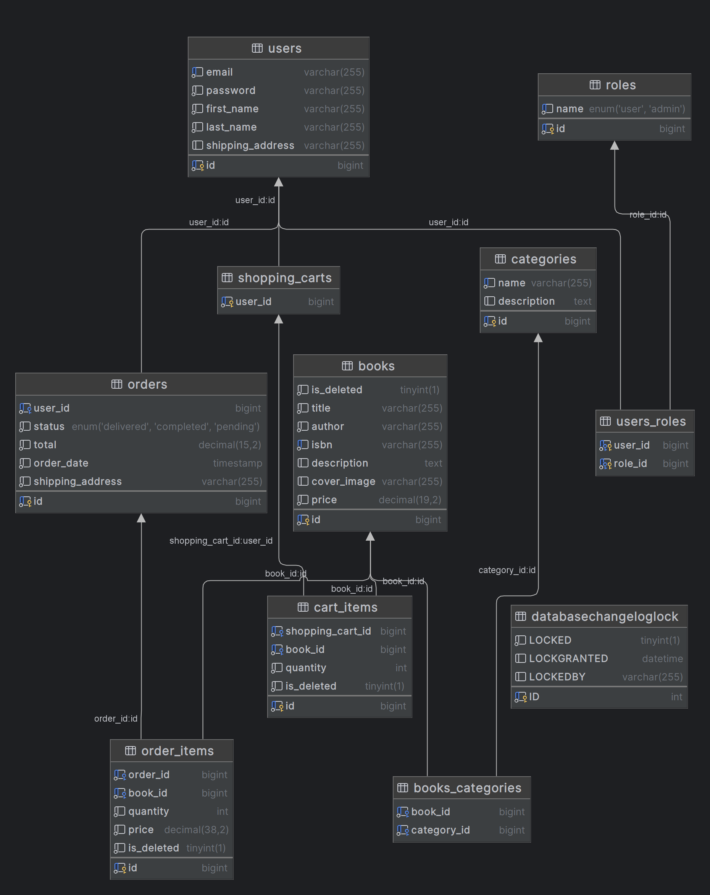
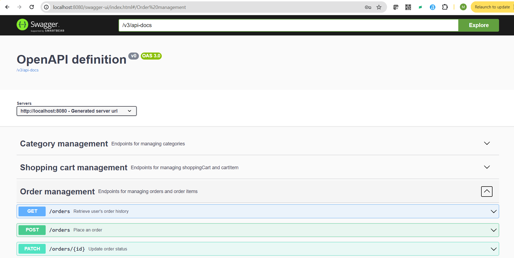

# Online Book Store Application

## Introduction

Welcome to the Online Book Store! This application serves as a digital marketplace where users can browse, search, purchase, and manage books online. Built to streamline the book acquisition process, it facilitates easy access to a wide range of books for reading enthusiasts.

## Technologies and Tools

This project uses a suite of advanced technologies and frameworks:
- **Spring Boot**: Enables rapid development and deployment.
- **Spring Security**: Ensures safe user interactions through comprehensive authentication and authorization.
- **Spring Data JPA**: Simplifies CRUD operations and database management.
- **Swagger (OpenAPI)**: Facilitates API documentation and testing.
- **MySQL**: Provides a robust database management system.
- **Docker**: Ensures consistent application execution across different environments.
- **JWT (JSON Web Tokens)**: Secures information transmission.
- **Liquibase**: Manages database schema migrations.

## Functionalities

- **AuthenticationController**: Manages user registration and login.
- **BookController**: Facilitates book management including CRUD operations.
- **CategoryController**: Organizes books into categories.
- **OrderController**: Handles order placements and updates.
- **ShoppingCartController**: Manages the shopping cart.



## Setup and Usage

1. **Clone the repository (make sure you have JDK installed):**
   ```bash
   git clone https://github.com/maiiat/online-book-store.git
   ```
2. **Navigate to the project directory:**
   ```bash
   cd online-book-store
   ```
3. **Build the project using Maven:**
   ```bash
   mvn clean install
   ```
4. **Run the application:**
   ```bash
   mvn spring-boot:run
   ```
5. **Access the application at:** `http://localhost:8080`

Alternatively, use Docker (make sure you have Docker installed):
   ```bash
   docker-compose up
   ```

## Challenges and Solutions

- **Security Implementation**: Integrated Spring Security and JWT to secure the application.
- **Database Management**: Used Liquibase to handle database schema changes smoothly.
- **Exception Handling**: Implemented servlet layer handling for JWT expiration to enhance security and user experience.

## Swagger

**Swagger is available for testing at http://localhost:8080/swagger-ui/index.html**



## Postman Collection

Explore the functionalities of the Online Book Store with our detailed Postman collection. This collection includes various API requests that allow you to register and login as users or admins, manage books and categories, handle shopping carts and orders, and more.

For a comprehensive testing experience, download the Postman collection here: [BOOK STORE ONLINE API.postman_collection.json](..%2F..%2FDesktop%2FBOOK%20STORE%20ONLINE%20API.postman_collection.json)

**Key Endpoints Include:**
- **User Authentication**: Register new users, login as user or admin separately to be able to use following api with appropriate jwt token.
- **Category Management**: Create, update, delete, and retrieve all categories.
- **Book Management**: Add, update, delete books, and retrieve books by ID or category.
- **Cart Operations**: Manage shopping cart items including adding, updating, and deleting cart items.
- **Order Processing**: Place orders and update order details.

## Conclusion
For more information or further assistance, feel free to open an issue in the project repository or contact the development team.
